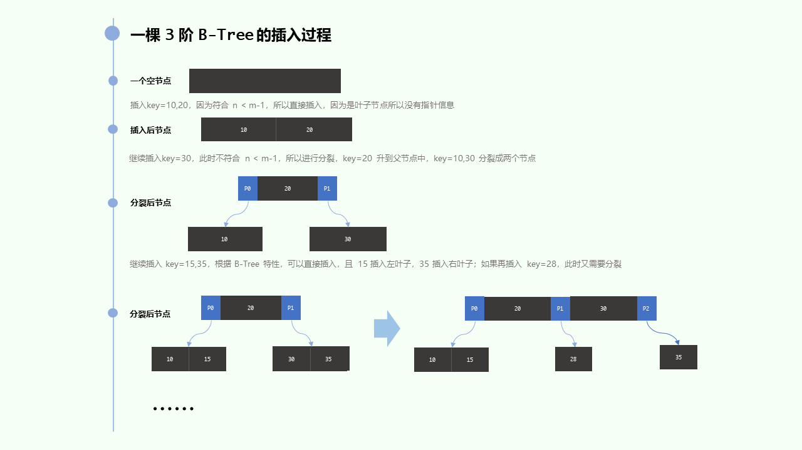

# MySQL索引相关 | B-Tree 和 B+Tree

### B-Tree

**B-Tree 定义**

B-Tree 是一棵平衡查找树，一棵 M 阶的 B-Tree 必须要满足以下特性：

- 树中每个节点至多有 m 个子节点；
- 树中除根节点和叶子节点外，每个节点至少有 m/2 个子节点（这里向上取整）；
- 根节点至少有两个子节点，除非它同时也是叶子节点；
- 叶子节点到根节点的距离一致，且叶子节点的指针为 NULL；
- 每个非终端结点中包含了 n 个 key。（ n 取值满足 m/2-1 <= n <= m-1 ）；

其中非叶子节点的结构由 K(i)(i = 1..,n)、P(i)(0 = 0...n) 组成，K表示关键字，并且升序排列，P表示指向子节点的指针，且P(i-1)所指向子节点的关键字小于 K(i)，大于 K(i-1)。因此大致结构为 [P0, K1, P1, K2, P2, K3, P3, K4 ... Kn, Pn]。

**B-Tree 的插入**

B-Tree 的插入规则是：
- 在叶子节点插入新元素；
- 如果叶子节点结构未满，可以直接插入（关键字数量小于 m-1），否则必须进行 分裂；
- 如果叶子节点结构满了，将该节点 分裂，将该节点分裂成两个节点，中间元素上移到父节点中；
- 如果父节点结构也满了，需要继续分裂，知道满足 B-Tree 特性为止。

**B-Tree 的查找**

- 查询从根节点开始
- 节点内使用二分查找法，找到直接返回数据，未找到，沿着节点间的指针查询子节点
- 重复操作二直到找到节点或指针为空（叶子节点）

在插入时要进行一次查找，判断元素是否在树中。

**B-Tree 的删除**

- 判断删除元素是否在树中
- 删除元素是否有子节点
    - 没有子节点，直接删除
    - 有子节点，删除后，取其孩子节点的相邻元素取代该节点（即左孩子的最右元素或右孩子的最左元素）
- 删除，移动元素后：
    - 节点处于 m/2-1 <= n <= m-1 状态，删除结束；
    - 节点不满足 n >= m/2-1，则需要观察相邻节点元素是否大于 m/2-1
        - 大于，相邻节点分裂一个元素到父节点中，并向父节点取一个元素补充到当前节点（父节点元素数不变，相邻节点也仍满足 n >= m/2-1），删除结束；
        - 不满足，则从父节点中取一个中间元素与当前节点及相邻节点合并为一个新节点（当前节点删除一个元素，从父节点拿来一个元素，现有元素 m/2-1，相邻节点也为 m/2-1，2*(m/2-1) < m-1，满足 B-Tree 特性），父节点被取元素后相当于删除元素，若满足 n >= m/2-1，删除结束，否则也需要进行上面操作。

### B+Tree

## 参考链接

[【数据结构】B-Tree, B+Tree, B*树介绍](http://blog.sina.com.cn/s/blog_6776884e0100ohvr.html)
[B树|编程之法：面试和算法心得](https://wizardforcel.gitbooks.io/the-art-of-programming-by-july/content/03.02.html)
[B树第三节学习（插入与删除的思路与理论）](http://luozhong915127.iteye.com/blog/1638116)
[【经典数据结构】B树与B+树](https://www.cnblogs.com/vincently/p/4526560.html)
[数据结构: B-Tree 简介及插入](https://zhuanlan.zhihu.com/p/24309634)